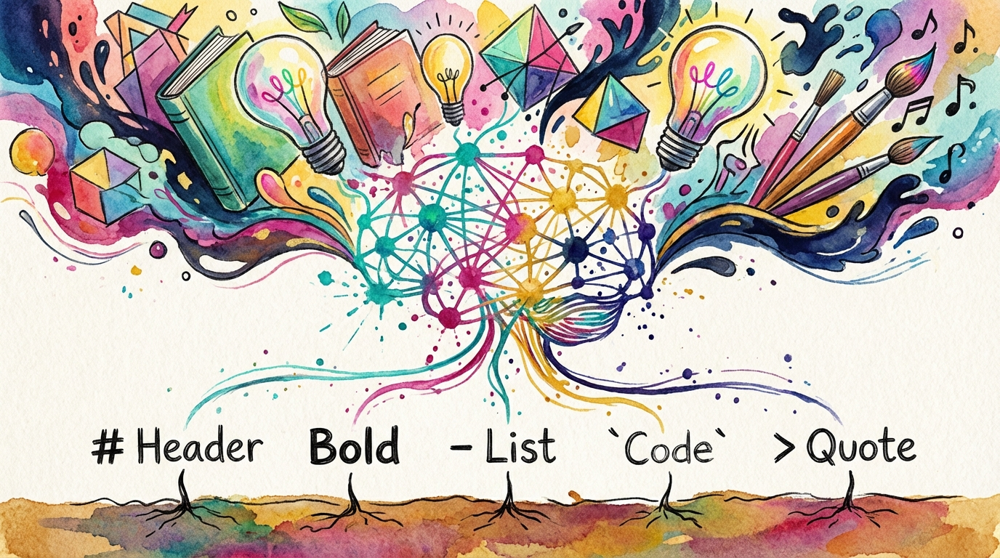

在人工智能（AI）大行其道的今天，我们与信息的交互方式发生了翻天覆地的变化。无论你是让 ChatGPT 帮你写一份营销方案，还是请 Gemini 总结长达百页的报告，你可能已经注意到了一个细节：它们的输出结果往往带有某种“排版感”——标题很大、列表整齐、代码块清晰。

这种排版方式背后的功臣，就是 **Markdown**（简称 MD）。

对于经常使用办公软件的成年人来说，我们习惯了 Word 的“所见即所得”，习惯了复杂的工具栏。但如果你希望在 AI 时代更高效地创作、管理知识，Markdown 绝不是程序员的专宠，而是你最值得投资的一项底层技能。

## 一、 什么是 Markdown？为什么大模型偏爱它？

简单来说，Markdown 是一种极其轻量级的“标记语言”。它用最简单的符号来代替排版操作。比如，在文字前加一个 `#` 号就代表一级标题，加两个 `##` 就是二级标题；想让文字加粗，只需要在两边加上 `**`。

[markdown语法速查表](https://markdown.com.cn/cheat-sheet.html)

为什么大模型输出默认都是这种格式？

1.  **极度简洁**：相比于 Word 文档（.docx）那种背后包含了大量隐藏格式代码的文件，Markdown 纯粹是由文字组成的。这对 AI 来说，生成成本最低，速度最快。
2.  **结构清晰**：Markdown 强迫我们思考内容的结构而非样式。AI 生成的标题、列表、引用，都能通过简单的标记让电脑（和人类）一眼看清逻辑。
3.  **跨平台通用**：无论你是在 Mac、Windows 还是手机上打开，Markdown 的内容永远不会乱码，也不会因为版本不兼容而打不开。

## 二、 Markdown 的核心特性：不仅是文字

很多人误以为 Markdown 只能写纯文字，其实它的扩展性非常强：

-   **图片与链接的“优雅”处理**：在 Word 中，图片被“塞”在文档里，容易导致文件体积巨大且排版崩溃。而在 Markdown 中，图片是以“链接”形式存在的。这意味着你可以轻松更换图片源，而不用担心文档损坏。
-   **强大的图表嵌入**：通过简单的代码块（如 Mermaid 语法），你可以在 Markdown 中直接绘制流程图、甘特图甚至复杂的数学公式。对于需要整理思路的专业人士来说，这简直是福音。
-   **无缝编辑体验**：当你熟练使用符号后，你的手指不需要离开键盘去寻找鼠标点击“加粗”或“对齐”。这种“心手合一”的输入感，能让你的思考不被打断。

## 三、 格式转换：从草稿到专业文档

你可能会担心：“我写好了 MD 格式，但我老板要的是 Word，客户要的是 PDF，怎么办？”

这正是 Markdown 的魅力所在。它本质上是**内容的原形**。有了这个原形，你可以通过各种工具将其“一键变身”：
-   转换为 **PDF**：生成排版极其精美的报告。
-   转换为 **Word (.docx)**：方便与不使用 MD 的同事协作。
-   转换为 **HTML**：直接发布到个人网站或博客。

这种“一次编写，多处分发”的能力，极大地节省了重复排版的时间。

## 四、 开启你的 Markdown 之旅：工具推荐

如果你是零基础起步，我强烈推荐 **Obsidian（黑曜石）**。

Obsidian 不仅仅是一个编辑器，它更是一个“第二大脑”。它完全基于 Markdown 格式，你的所有笔记都以纯文本形式存储在本地，这意味着你永远拥有对数据的所有权。

**我个人的推荐工具组合：**

1.  **深度创作与管理：Obsidian + Enhancing Export 插件**
    -   在 Obsidian 中写作，利用它的双向链接功能整理思路。
    -   使用 `Enhancing Export` 插件，你可以直接将笔记导出为精美的 Word 或 PDF。它调用了底层强大的 Pandoc 转换引擎，效果非常专业。

2.  **轻量阅读与预览：Markdown Viewer 浏览器插件**
    -   当你从 AI 网页端复制 Markdown 内容，或者在本地查看 MD 文件时，Markdown Viewer 可以让原本朴素的文本瞬间变得赏心悦目，支持各种精美的主题预览。

## 五、 结语

在 AI 辅助创作的今天，我们不再缺内容，缺的是对内容的**组织力**和**分发效率**。

学会 Markdown，就像是学会了与 AI 沟通的“标准语言”。它让你从繁琐的鼠标操作中解脱出来，回归到内容创作的本质。它简单到你只需要花 10 分钟记住几个符号，却能受益于整个数字创作生涯。

现在，不妨打开一个 AI 聊天窗口，观察一下它是如何用 `#` 和 `*` 为你构建世界的。那就是你迈向高效创作的第一步。

